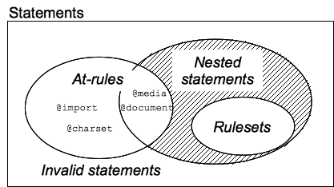

# html

## 简介

HTML 是一种标记语言（markup language）。


它告诉浏览器如何显示内容。


HTML使用预先定义的元素集合来识别内容形态。 元素包含一个以上的标记来包含或者表达内容。标记利用尖括号表示，而结束标记（用来指示内容尾端）则在前面加上斜线。


举例来说，段落元素包含起始标记“`<p>`”和结束标记“`</p>`”。


下面的例子展示一个包含HTML段落元素的段落


> `<p>You are beginning to learn HTML.</p>`


<p>You are beginning to learn HTML.</p>

## 元素--基本的构造区块

HTML由不同元素的集合组成。元素定义了它们所包含内容的语义。元素包含了两个相匹配的元素标签之中所有的内容，当然也包含了标签本身。例如，"`<p>`"标签表示一个段落；"``"标签表示一张图片。

[元素语意](https://developer.mozilla.org/zh-CN/docs/Web/HTML/Element)

大部分的元素都支持元素嵌套，构成了一个层次结构。

 一个简单的完整的网页结构例子如下所示：

```HTML
<html>
  <body>
    <p>My dog ate all the guacamole.</p>
  </body>
</html>
```

## 标签

### 块级元素

`div  , p  , form,   ul,  li ,  ol, dl,    form,   address,  fieldset,  hr, menu,  table`

#### 特点

> 1.总是在新行上开始

> 2.高度，行高以及外边距和内边距都可控制

> 3.宽度缺省是它的容器的100%，除非设定一个宽度

> 4.它可以容纳内联元素和其他块元素

### 内联元素

`span,   strong,   em,  br,  img ,  input,  label,  select,  textarea,  cite`

#### 特点

> 1 和其他元素都在一行上

> 2 高，行高及外边距和内边距不可改变(左右边距可用)

> 3 宽度就是它的文字或图片的宽度，不可改变

> 4 内联元素只能容纳文本或者其他内联元素

## 属性

开始标签可能包含一些信息，这些信息叫做元素的特性，包括两部分:

> * 特性名.

> * 特性值.

## 命名字符参考

命名字符参考 (一般被称作实体) 用于表示在HTML中具有特定含义的字符. 举例说，HTML将“>”和“<”符号理解为标签分隔符。所以，当你想在文本中用">"符号表达“大于”的含义时，你可以使用命名字符参考来作为替代。

以下例举了四个非常重要的常用实体：

> * `&gt;` 表示大于符号">" (>)

> * `&lt;` 表示小于符号"<" (<)

> * `&amp;` 表示和符号"and"(&)

> * `&quot;` 表示引用符号" (")

更多的[实体符号](https://www.w3.org/TR/2011/WD-html5-20110113/named-character-references.html)

## 文档类型和注释

### 文档类型

除标签，文本内容和实体外，一个HTML文档一定需要在第一行做出文档类型断言(doctype declaration)。在现代HTML中，这句断言书写如下：

> `<!DOCTYPE html>`

### 注释

> `<!-- This is comment text -->`

## 一个完整的HTML页面

```HTML
<!DOCTYPE html>
<html lang="en">
<head>
  <meta charset="utf-8" />
  <title>A tiny document</title>
</head>
<body>
  <h1>Main heading in my document</h1>
  <!-- Note that it is "h" + "1", not "h" + the letter "one" -->
  <p>Loook Ma, I am coding <abbr title="Hyper Text Markup Language">HTML</abbr>.</p>
</body>
</html>
```


# css

## 简介

层叠样式表（ `Cascading Stylesheet` ，简称`CSS` ）， 其基本目标是让浏览器以指定的特性去绘制页面元素，比如颜色，定位，装饰。`CSS`的语法反映了这个目标，由下面两个部分构建：

> * 属性（ property）是一个标识符，用可读的名称来表示其特性

> * 值（value）则描述了浏览器引擎如何处理该特性。每个属性都包含一个有效值的集合，它有正式的语法和语义定义，被浏览器引擎实现

## css声明

CSS的核心功能是将CSS属性设定为特定的值。一个属性与值的键值对被称为”声明“（declaration） 。CSS引擎会计算页面上每个元素都有哪些声明，并且会根据结果绘制元素，排布样式

在CSS中，**属性和值对大小写都是敏感的**。属性与值之间以英文冒号 ':' （U+003A COLON）隔开。属性与值前面、后面与两者之间的空白不是必需的，会被自动忽略。


[css属性](https://developer.mozilla.org/en-US/docs/Web/CSS/Reference)

## css声明块

声明会按照**块**的形式被组合。声明块（declaration block）以英文左大括号('{' U+007B LEFT CURLY BRACKET)开始，以英文右大括号 '}' (U+007D RIGHT CURLY BRACKET)结束。块有时会嵌套，所以开始与结束大括号必须要匹配。


**声明块**里面的声明之间使用英文分号（';'  U+003B SEMICOLON）隔开。声明块可能为空，也就是包含空的声明。声明之间的空格会被忽略，声明块里最后一个声明可以不用分号，不过建议加上，以方便扩展声明块。


## css规则

如果样式表只能为每个页面元素添加一个声明，那就没有真正发挥出它的价值。其真正的目标是为文档不同部分添加不同的声明。

为此，CSS可以在声明块前面放置选择器（selector)，选择器用来选择页面多个元素的条件。一对选择器与声明块称为规则集（ruleset)，常简称为规则（rule)。


一个元素可能被多个选择器选中，因此会有多个规则，有可能以不同的值去设置同一属性。CSS标准会规定哪个优先级最高并生效, 称之为 **层叠（cascade)** 算法。

## css语句

规则是样式表的主体，通常样式表会包括大量的规则列表。但有时候网页的作者也希望在样式表中包括其他的一些信息，比如字符集，导入其它的外部样式表，字体等，这些需要专门的语句表示。

语句以非空格的字符开头，以第一个反花括号或分号结束。



语句类型：

> * 规则。如上，将一组CSS声明与用选择器定义的条件相关联。

> * at规则 ([at-rules](https://developer.mozilla.org/en-US/docs/Web/CSS/At-rule))。以@ (U+0040 COMMERCIAL AT) 开始，随后是标识符，一直到以分号或右大括号结束。每个at规则由其标识符定义，可能有它自己的语法。at规则涵盖了meta信息（比如 @charset  @import)，条件信息（比如@media  @document), 描述信息（比如@font-face)。

不是上面类型的语句则是非法的，被忽略。

条件规则组（conditional group rules）是特殊的at规则，可以嵌套语句。它里面的语句只有在特定条件下才生效。

## css选择器

css选择器的作用是css规则对应到html元素上

> * 基本选择器

>> * 元素选择器 `elementname`

>> * 类选择器 `.classname`

>> * ID选择器 `#idname`

>> * 通配符选择器 `* ns|* *|*`

>> * 属性选择器 `[attr=value]`

> * 组合选择器

>> * 相邻兄弟选择器 `A + B`

>> * 普通兄弟选择器 `A ~ B`

>> * 子选择器 `A > B`

>> * 后代选择器 `A B`

> * 伪类

>> * `:hover`

>> * `:active`

>> * `:link`

>> * `:visited`

>> * `:focus`

[更多选择器](https://www.w3.org/TR/selectors/#selectors)

## css优先级

### 概念

浏览器通过**优先级**来判断哪一些属性值与一个元素最为相关，从而在该元素上应用这些属性值。优先级基于 由各种选择器组成的匹配规则。

### 优先级计算

优先级就是一个 应用于指定的CSS声明的 权重，它由 匹配的选择器中的 每一种选择器类型的 数值 决定。

而当优先级与多个CSS声明中任意一个声明的优先级相等的时候，CSS中最后的那个声明将会被应用到元素上。

当同一个元素有多个声明的时候，优先级才会有意义。因为每一个直接作用于元素的CSS规则总是会接管/覆盖（take over）该元素从祖先元素继承而来的规则。

优先级逐级增加的选择器列表

> * 英文版

>> * 元素(类型)选择器（type selectors）（例如：h1）和 伪元素选择器（pseudo-elements）（例如：:before）

>> *　类选择器（class selectors） (例如：.example)，属性选择器（attributes selectors）（例如：[type="radio"]），伪类选择器（pseudo-classes）（例如：:hover）

>> *　ID选择器（例如：#example）

> *　中文版

>> * 通用选择器（*）

>> * 元素(类型)选择器（type selectors）

>> * 类选择器

>> * 属性选择器

>> * 伪类

>> * ID 选择器

>> * 内联样式

[更详细内容](https://developer.mozilla.org/zh-CN/docs/Web/CSS/Specificity)

## 盒模型

文档中的每个元素被描绘为矩形盒子。渲染引擎的目的就是判定大小，属性——比如它的颜色、背景、边框方面——及这些盒子的位置。

在CSS中，这些矩形盒子用 标准盒模型 来描述。这个模型描述了一个元素所占用的空间。每一个盒子有四条边界：外边距边界`margin edge`, 边框边界`border edge`, 内边距边界`padding edge` 与 内容边界`content edge`。


**最后，请注意，对于非替换的行内元素来说，尽管内容周围存在内边距与边框，但其占用空间（行高）由 line-height 属性决定。**
**注意margin合并问题**

## 布局类

### 浮动

float: none | left | right;

### 定位

position: static | relative | absolute | fixed;

## css注释

### 概述

注释用来为部分CSS代码添加额外的解释,或者用来组织浏览器解析一部分区域内的CSS代码.

### 语法

> `/* Comment */`

### 示例

```css
    /* 这是一行单行注释 */

    /*
    这个注释分散
    在了多个物理
    行上面
    */
```

备注：

[css全局索引](https://developer.mozilla.org/zh-CN/docs/Web/CSS/Reference)

[css 属性值定义语法 （在学习css时有用）](https://developer.mozilla.org/zh-CN/docs/Web/CSS/Value_definition_syntax)


# js

[js 目录](https://developer.mozilla.org/zh-CN/docs/Web/JavaScript)
[具体参考](https://developer.mozilla.org/zh-CN/docs/Web/JavaScript/Guide)